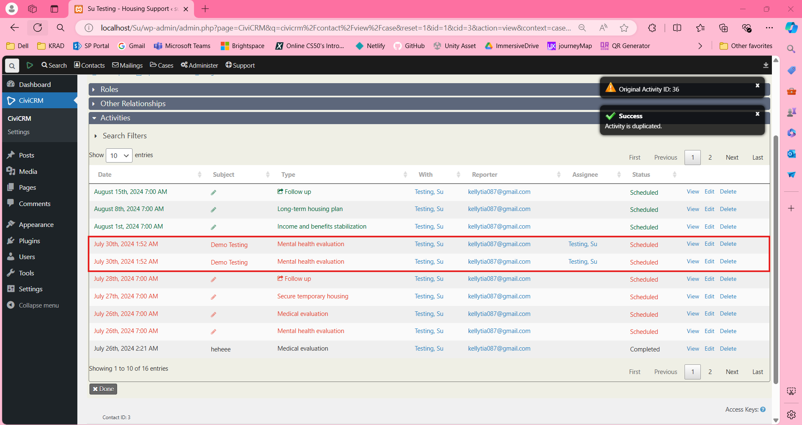

# Duplicate Activity Extension

This extension allows users to duplicate activities, including those under a case, in CiviCRM.

## Getting Started

### Prerequisites

- CiviCRM installed and running.
- Appropriate permissions to install and manage extensions.

### Installation

1. Navigate to **Administer >> System Settings >> Extensions**.
2. Locate and install the extension named **Octopus8 Duplicate Activity**.
   

### Usage

1. Once the extension is enabled, navigate to the Activity you wish to duplicate. This can be an individual activity or an activity under a case.
2. Click the **Edit** button for the selected activity.
   

3. If the extension is installed successfully, you will see a **Duplicate** button.
4. Click the **Duplicate** button.
   

5. A new activity will be created with the same data as the original activity.
6. Verify that all details in the duplicated activity are identical to the original and that it works for all data types.
   

## Important Notes

### Don'ts

- **DO NOT CLICK** the **Duplicate** button while creating a new activity. If you do, it will function as a **Save** button, resulting in only one activity being created. Apart from throwing the error of **Original ID is not found**, it still performing of saving the activity.
  
  

## License

This extension is licensed under the [AGPL-3.0](LICENSE.txt).

## Support

For more information on CiviCRM extensions, refer to the [CiviCRM Documentation](https://docs.civicrm.org/sysadmin/en/latest/customize/extensions/).

For issues or contributions, please refer to the repository.

---

Feel free to reach out for further assistance or customization requests.
